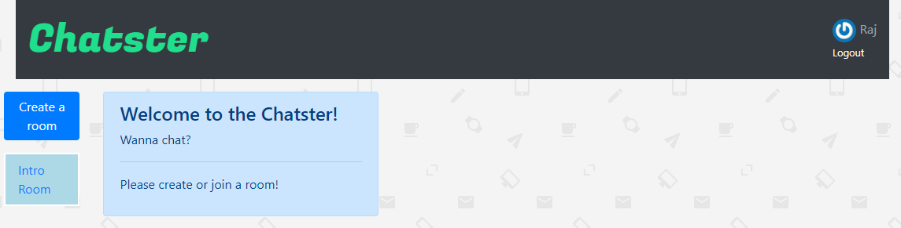

# Chatster

This simple app was created to allow users to create chat rooms and chat with each other in the same window. Action Cable helped with the integration of WebSockets with Ruby on Rails. Bootstrap was used for styling. Also, Devise helped with user authentication.

## Click [here](https://raj-chatster.herokuapp.com/) for the live app.

This is the home page:

This is how the chat rooms are listed:

An example of a chat:

## Tools & Resources

* [Ruby on Rails](https://rubyonrails.org/) 
* [PostgreSQL](https://www.postgresql.org/)
* [Bootstrap](https://getbootstrap.com/)
* [Devise](https://github.com/plataformatec/devise/)
* [Action Cable](https://guides.rubyonrails.org/action_cable_overview.html)

Enjoy your day!